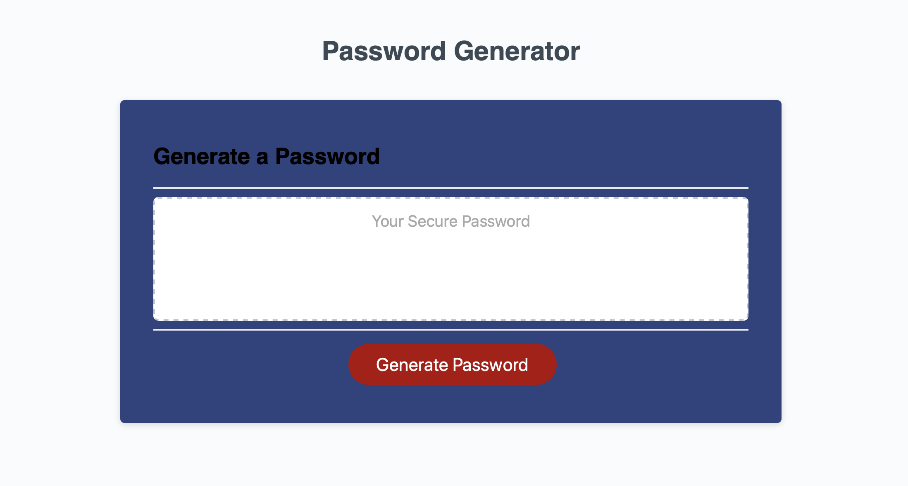

This is a password generator designed to help users generate a random password. The application should help the user create a secure pasword while allowing control of how rigorious the reqirements of the password will be. The user can chose the length between 8 and 128 characters. The user can decide if the want uppercase letters, lowercase letter, alphanumerics, and special characters. The user can select any combination of these characters as long as they pick at least one. When the user is done selecting parameters a password is generated for their use. The password is not stored or recorded so it remains anonymous. 

https://bowerpower85.github.io/PasswordGenerator/

